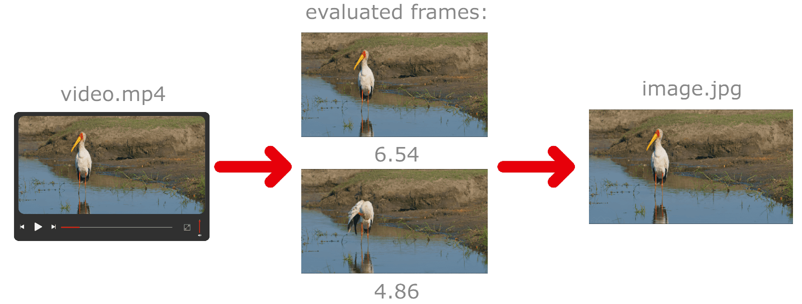
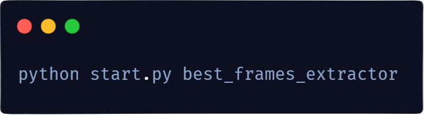
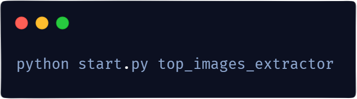
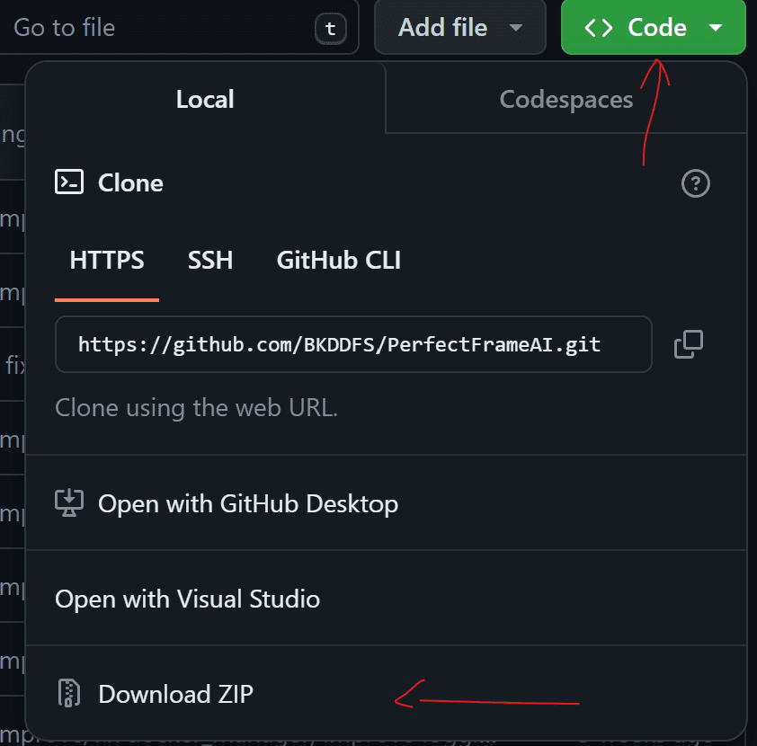
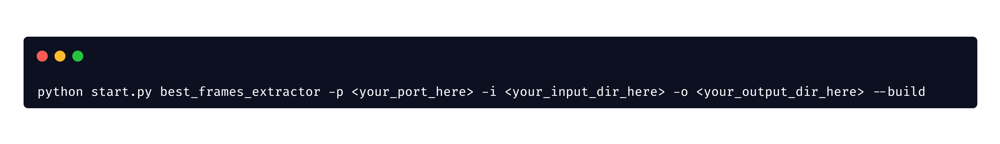
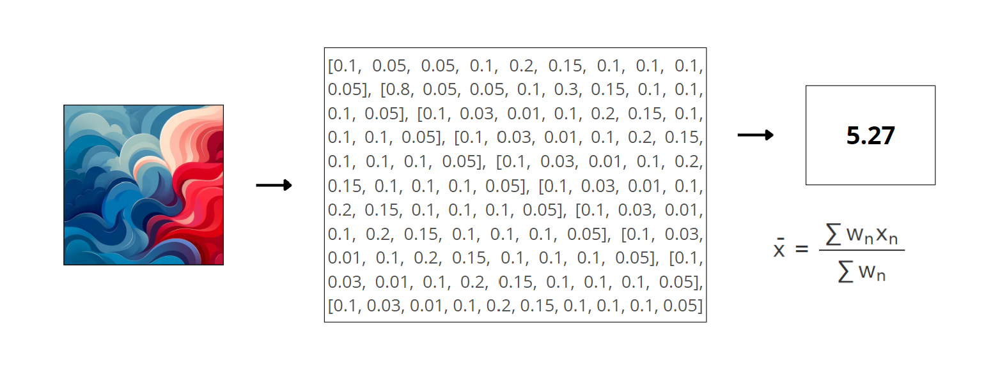
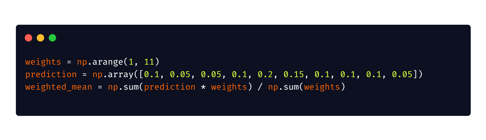
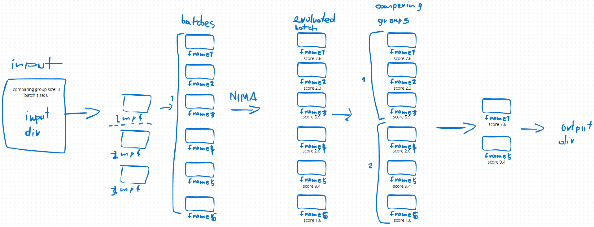
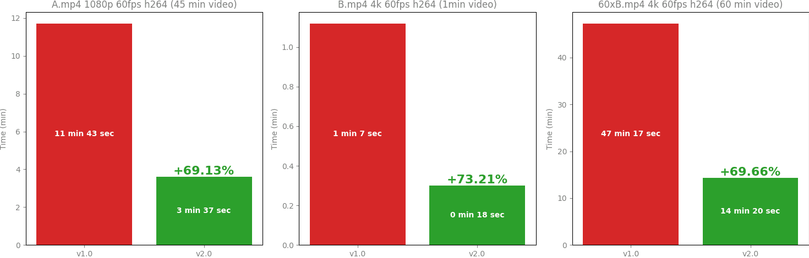
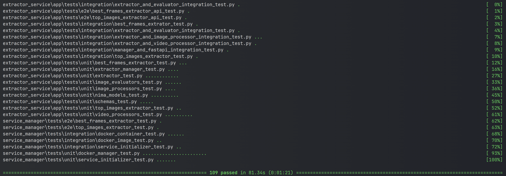

    

    

        
        
        
        
    

    

        <a href="#about">O projekcie</a> &nbsp;&bull;&nbsp;
        <a href="#key-features">Kluczowe Funkcje</a> &nbsp;&bull;&nbsp;
        <a href="#installation">Instalacja</a> &nbsp;&bull;&nbsp;
        <a href="#usage">Jak używać</a> &nbsp;&bull;&nbsp;
        <a href="#contributions">Contribute</a> &nbsp;&bull;&nbsp;
        <a href="#feedback">Feedback</a> &nbsp;&bull;&nbsp;
        <a href="#licence">Licencja</a>
    

    

        <a href="/README.md">English</a> &nbsp;&bull;&nbsp;
        <a href="/README.pl.md">Polski</a>
    

    W świecie przesyconym treściami wideo, każda sekunda ma potencjał, by stać się niezapomnianym ujęciem.
    <code>PerfectFrameAI</code> to narzędzie wykorzystujące sztuczną inteligencję do analizowania materiałów wideo
    i automatycznego zapisywania najładniejszych klatek.

    <h2>🔎 Demo</h2>
    
    
Full demo: <a href="https://youtu.be/FX1modlxeWA">https://youtu.be/FX1modlxeWA</a>

    

    <h2>🔑 Kluczowe funkcje:</h2>
    

        

            <strong>Best Frames Extraction 🎞️➜🖼️</strong>
            <blockquote>Wybieranie najlepszych klatek z plików video.</blockquote>
        

        
        <ol>
            
Input: Folder z plikami video <code>.mp4</code>.

            <li>Bierze pierwsze video ze wskazanej lokalizacji.</li>
            <li>
                Dzieli wideo na klatki.
                Klatki są brane co 1 sekundę wideo.
                Klatki są przetwarzane w batchach(seriach).
            </li>
            <li>Ocenia wszystkie klatki w batchu za pomocą modelu AI i nadaje im ocenę liczbową.</li>
            <li>Dzieli batch klatek na mniejsze grupy.</li>
            <li>Wybiera klatkę z najwyższą oceną liczbową z każdej grupy.</li>
            <li>Zapisuje klatki z najlepszymi ocenami w wybranej lokalizacji. </li>
            
Output: Klatki zapisane jako <code>.jpg</code>.

        </ol>
    

     
    

        

            <strong>Top Images Extraction 🖼️➜🖼️</strong>
            <blockquote>Wybieranie najlepszych obrazów z folderu z obrazami.</blockquote>
        

        
        <ol>
            
Input: Folder z obrazami <code>.jpg</code>.

            <li>Wczytuje obrazy. Obrazy są przetwarzane batchach(seriach).</li>
            <li>Ocenia wszystkie obrazy w batchu za pomocą modelu AI i nadaje im ocenę liczbową.</li>
            <li>
                Oblicza, jaki wynik musi mieć obraz, żeby znaleźć się w top 90% obrazów.
                W <code>schemas.py</code> można zmienić tę wartość - <code>top_images_percent</code>.
            </li>
            <li>Zapisuje obrazy o  w wybranej lokalizacji. </li>
            
Output: Obrazy zapisane jako <code>.jpg</code>.

        </ol>
    

    <h2>💿 Instalacja</h2>
    <blockquote>
        <h3 >Wymagania systemowe:</h3>
        <ul>
            <li>Docker</li>
            <li>Python ^3.10 (tylko sposób 1)</li>
            <li>Nvidia GPU (zalecane)</li>
            <li>10 GB wolnego miejsca na dysku</li>
        </ul> 
    </blockquote>
    

        
Zainstaluj Dokcer:

        Docker Desktop: <a href="https://www.docker.com/products/docker-desktop/">https://www.docker.com/products/docker-desktop/</a>
    

    

        
Zainstaluj Python v3.10+:

        MS Store: <a href="https://apps.microsoft.com/detail/9ncvdn91xzqp?hl=en-US&gl=US">https://apps.microsoft.com/detail/9ncvdn91xzqp?hl=en-US&gl=US</a> 
        Python.org: <a href="https://www.python.org/downloads/">https://www.python.org/downloads/</a>
    

    

        
Pobierz <code>PerfectFrameAI</code>

        <blockquote>
            Aby pobrać kod z repozytorium na GitHubie, kliknij przycisk <code>Code</code>,
            a następnie wybierz <code>Download ZIP</code>
            lub skopiuj adres URL i użyj polecenia <code>git clone</code> w terminalu.
        </blockquote>
        
    

    <h2>⚡ Jak używać:</h2>
    

        

            <strong style="font-size: 20px;"> 🚀 Sposób 1 - CLI </strong>
            <blockquote>
<i>Wymaga Pythona. Jest prosty i wygodny.</i>
</blockquote>
        

        
Uruchom <code>start.py</code> z terminala.

        
<strong>Przykład dla Best Frames Extraction:</strong>

        <code>python start.py best_frames_extractor</code>
        <table id="flags">
            <caption><strong>Dostępne flagi</strong></caption>
            <thead>
                <tr>
                    <th>Flaga</th>
                    <th>Krótka</th>
                    <th>Opis</th>
                    <th>Typ</th>
                    <th>Domyślna wartość</th>
                </tr>
            </thead>
            <tbody>
                <tr>
                    <td>--input_dir</td>
                    <td>-i</td>
                    <td>Zmiana inputu</td>
                    <td>str</td>
                    <td>./input_directory</td>
                </tr>
                <tr>
                    <td>--output_dir</td>
                    <td>-o</td>
                    <td>Zmiana outputu</td>
                    <td>str</td>
                    <td>./output_directory</td>
                </tr>
                <tr>
                    <td>--port</td>
                    <td>-p</td>
                    <td>Zmiana portu na którym będzie działał <code>extractor_service</code></td>
                    <td>int</td>
                    <td>8100</td>
                </tr>
                <tr>
                    <td>--build</td>
                    <td>-b</td>
                    <td>
                        Buduje nowy Docker image z nowymi podanymi ustawieniami.
                        Używaj zawsze z flagą --build, jeśli nie rozumiesz.
                    </td>
                    <td>bool</td>
                    <td>False</td>
                </tr>
            </tbody>
        </table>
        
<strong>Przykład dla Best Frames Extraction:</strong>
 
        
        
Inne domyślne parametry możesz edytować w config.py.

        <blockquote>
            
<strong style="color: lightblue;">Ułatwienie dla użytkowników Windows:</strong> 
            Jeśli korzystasz z Windows, możesz skorzystać z dołączonego pliku <code>quick_demo.bat</code>,
            który włączy best_frames_extractor na [wartościach domyślnych] zapisanych w config.py.
            Możesz zmienić config.py, żeby dopasować aplikację do swoich potrzeb.

        </blockquote>
    

    

        

            <strong style="font-size: 20px;">🐳 Sposób 2 - docker-compose.yaml:</strong>
            <blockquote>
<i>Nie wymaga Pythona. Uruchom używając Docker Compose.</i>
</blockquote>
        

        
Docker Compose Docs: <a href="https://docs.docker.com/compose/">https://docs.docker.com/compose/</a>

        <ol>
            <li>Uruchom serwis:  <code>docker-compose up --build -d</code></li>
            <li>Wyślij zapytanie pod wybrany endpoint.
            
<strong>Przykładowe zapytania:</strong>

                <ul>
                    <li>Best Frames Extraction: <code>POST http://localhost:8100/extractors/best_frames_extractor</code></li>
                    <li>Top Frames Extraction: <code>POST http://localhost:8100/extractors/top_images_extractor</code></li>
                    <li>Obecnie pracujący extractor: <code>GET http://localhost:8100/</code></li>
                </ul>
            </li>
            Możesz ewentualnie edytować docker-compose.yaml, jeśli nie chcesz korzystać z ustawień domyślnych.
        </ol>
    

    <h2>💡O projekcie:</h2>
    

        <h3>Spis treści:</h3>
        <a href="#how-it-works">Jak to działa</a> 
        &nbsp&nbsp&nbsp&nbsp<a href="#input">Input modelu</a> 
        &nbsp&nbsp&nbsp&nbsp<a href="#output">Wyniki oceniania obrazów</a> 
        &nbsp&nbsp&nbsp&nbsp<a href="#classes">Klasy estetyczne</a> 
        &nbsp&nbsp&nbsp&nbsp<a href="#calculating-mean">Obliczanie ostatecznej oceny obrazu</a> 
        <a href="#implementation">Jak to jest zaimplementowane w skrócie</a> 
        &nbsp&nbsp&nbsp&nbsp<a href="#model-architecture">Architektura modelu</a> 
        &nbsp&nbsp&nbsp&nbsp<a href="#weights">Wagi modelu</a> 
        &nbsp&nbsp&nbsp&nbsp<a href="#normalization">Normalizacja obrazów</a> 
        &nbsp&nbsp&nbsp&nbsp<a href="#predictions">Przewidywanie przynależności do klas</a> 
        &nbsp&nbsp&nbsp&nbsp<a href="#mean-calculation">Obliczanie średniej ważonej</a> 
        <a href="#1vs2">v1.0 vs v2.0</a> 
        <a href="#build-with">Użyte technologie</a> 
        <a href="#tests">Testy</a> 
        &nbsp&nbsp&nbsp&nbsp<a href="#unit">jednostkowe</a> 
        &nbsp&nbsp&nbsp&nbsp<a href="#integration">integracyjne</a> 
        &nbsp&nbsp&nbsp&nbsp<a href="#e2e">e2e</a> 
    

    

    <h2>📐 Jak to działa</h2>
    

        Narzędzie używa modelu zbudowanego zgodnie z zasadami dla modeli
        Neural Image Assessment (NIMA) do określania estetyki obrazów.
    

    
    

       
<strong>Input modelu</strong>

       
Model przyjmuje odpowiednio znormalizowane obrazy w batchu Tensor.

    

    <h3 id="output">Wyniki oceniania obrazów</h3>
    

    Model NIMA, po przetworzeniu obrazów, zwraca wektory prawdopodobieństw, 
    gdzie każda z wartość w wektorze odpowiada prawdopodobieństwu, 
    że obraz przynależy do jednej z klas estetycznych.
    

    

        
<strong>Klasy estetyczne</strong>

        

            Jest 10 klas estetycznych. W modelu NIMA każda z 10 klas odpowiada
            określonemu poziomowi estetyki, gdzie:
        

        <ul>
            <li>Klasa 1: Bardzo niska jakość estetyczna.</li>
            <li>Klasa 2: Niska jakość estetyczna.</li>
            <li>Klasa 3: Poniżej średniej jakości estetycznej.</li>
             ...
            <li>Klasa 10: Wyjątkowo wysoka jakość estetyczna.</li>
        </ul>
    

    <h3 id="calculating-mean">Obliczanie ostatecznej oceny obrazu</h3>
    

        Ostateczna ocena obrazu jest obliczana za pomocą średniej
        ważonej z wyników dla każdej z klas, gdzie wagi są 
        wartościami klas od 1 do 10.
    

    <h4>Przykład:</h4>
    

       Załóżmy, że model zwraca następujący wektor 
       prawdopodobieństw dla jednego obrazu:
    

    <pre>[0.1, 0.05, 0.05, 0.1, 0.2, 0.15, 0.1, 0.1, 0.1, 0.05]</pre>
    Oznacza to, że obraz ma:
    <ul>
        <li>10% prawdopodobieństwa przynależności do klasy 1</li>
        <li>5% prawdopodobieństwa przynależności do klasy 2</li>
        <li>5% prawdopodobieństwa przynależności do klasy 3</li>
        <li>i tak dalej...</li>
    </ul>
    

       Obliczając średnią ważoną z tych prawdopodobieństw,
       gdzie wagi to wartości klas (1 do 10):
    

    
    

    

        <h2>📖 Implementacja w skrócie</h2>
        
        

            
<strong>Architektura modelu</strong>

            

                Model NIMA używa architektury InceptionResNetV2 jako swojej podstawy.
                Ta architektura jest znana ze swojej wysokiej wydajności w zadaniach
                klasyfikacji obrazów.
            

        

        

            
<strong>Wagi modelu</strong>

            

                Model korzysta z wcześniej wytrenowanych wag,
                wytrenowanych na dużym zbiorze danych (AVA dataset) obrazów
                ocenionych pod kątem ich jakości estetycznej.
                Narzędzie automatycznie pobiera wagi i przechowuje je
                w voluminie Docker do dalszego użytkowania.
            

        

        

            
<strong>Normalizacja obrazów</strong>

            

                Przed wprowadzeniem obrazów do modelu, są one normalizowane,
                aby upewnić się, że mają właściwy format i zakres wartości.
            

        

        

            
<strong>Przewidywanie przynależności do klas</strong>

            

                Model przetwarza obrazy i zwraca wektor 10 prawdopodobieństw,
                z których każde reprezentuje prawdopodobieństwo przynależności
                obrazu do jednej z 10 klas jakości estetycznej
                (od 1 dla najniższej jakości do 10 dla najwyższej jakości).
            

        

        

            
<strong>Obliczanie średniej ważonej</strong>

            

                Ostateczny wynik estetyczny dla obrazu jest obliczany
                jako średnia ważona tych prawdopodobieństw,
                przy czym wyższe klasy mają większe wagi.
            

        

    

    

        <h2>✅ v1.0 vs v2.0</h2>
        

            <code>PerfectFrameAI</code> to narzędzie stworzone na podstawie jednego z mikro serwisów mojego głównego projektu. 
            Określam tamtą wersję jako <code>v1.0</code>.
        

        <table>
            <tr>
                <th>Feature</th>
                <th>v1.0</th>
                <th>v2.0</th>
            </tr>
            <tr>
                <td>CLI</td>
                <td class="cross">❌</td>
                <td class="check">✅</td>
            </tr>
            <tr>
                <td>Zautomatyzowana instalacja</td>
                <td class="cross">❌</td>
                <td class="check">✅</td>
            </tr>
            <tr>
                <td>Szybki i Prosty Setup</td>
                <td class="cross">❌</td>
                <td class="check">✅</td>
            </tr>
            <tr>
                <td>Wydajność</td>
                <td>+0%</td>
                <td>+70%</td>
            </tr>
            <tr>
                <td>Rozmiar*</td>
                <td class="cross">12.6 GB</td>
                <td class="check">8.4 GB</td>
            </tr>
            <tr>
                <td>Open Source</td>
                <td class="cross">❌</td>
                <td class="check">✅</td>
            </tr>
        </table>
        
*v1.0 wszystkie zależności i model vs v2.0 docker image + model

        <h3>Porównanie wydajności:</h3>
        <ul>
            <h4>Platforma:</h4>
            <li>RTX3070ti (8GB)</li>
            <li>i5-13600k</li>
            <li>32GB RAM</li>
        </ul>
        
    

    

    <h2>🛠️ Użyte technologie</h2>
    <ul>
        <li>Python - główny język w którym jest napisany projekt.
            Zewnętrzna część <code>PerfectFrameAI</code> używa tylko standardowych biblotek Pythona dla ułatwienia instalacji i kofiguracji narzędzia.</li>
        <li>FastAPI - framework na którym została zbudowana główna część <code>PerfectFrameAI</code> (w v1.0 Flask).</li>
        <li>OpenCV - do manipulacji obrazami.</li>
        <li>numpy - do operacji na tablicach wielowymiarowych.</li>
        <li>FFMPEG - jako rozszerzenie do OpenCV, do dekodowania klatek video.</li>
        <li>CUDA - do umożliwienia wykonywania operacji na kartach graficznych.</li>
        <li>Tensorflow - wykorzystywana bibloteka do uczenia maszynowego (w v1.0 PyTorch).</li>
        <li>Docker - dla ułatwienia budowania skąplikowanego środowiska pracy dla <code>PerfectFrameAI</code>.</li>
        <li>pytest - framework w którym napisane są testy.</li>
        <li>docker-py - używany jedynie do testowania integracji Dockera z dołączonym managerem <code>PerfectFrameAI</code>.</li>
        <li>Poetry - do zażądzania zależnościami projektu.</li>
        <blockquote>Wszystkie używane zależności dostępne są w <a href="https://github.com/BKDDFS/PerfectFrameAI/blob/main/pyproject.toml">pyproject.toml.</a></blockquote>
    </ul>
    

    

        <h2>🧪 Testy</h2>
        
        

            Testy możesz uruchomić instalując zależności z <code>pyproject.toml</code>
            i wpisując w terminal w lokalizacj projektu - <code>pytest</code>.
        

        <blockquote>
            Proszę zwrócić uwagę, że w projekcie są dwa foldery <code>tests/</code>.
            <code>extractor_service</code> i <code>service_initializer</code> mają testy osobno.
            W pliku common.py znajdują się pliki wpółdzielone przez testy i potrzebne do ich działania.
        </blockquote>
        

            
jednostkowe

            

            Każdy moduł ma swoje testy jednostkowe.
            Testują one każdą z metod i funkcji dostępnych w modułach.
            Test coverage wynosi 100% (testy w całości pokrywają logikę biznesową).
            

        

        

            
integracyjne

            <ul>
                <li>Testowanie integracji docker_manager z Dockerem.</li>
                <li>Testowanie integracji z parserem.</li>
                <li>Testowanie integracji logiki biznesowej z modelem NIMA.</li>
                <li>Testowanie integracji z FastAPI.</li>
                <li>Testowanie integracji z OpenCV.</li>
                <li>Testowanie integracji z FFMPEG.</li>
                <li>Testowanie integracji modułów między sobą na różne sposoby...</li>
            </ul>
        

        

            
e2e

            <ul>
                <li>Testowanie działania extractor_service jako całość.</li>
                <li>Testowanie działania extractor_service+service_initializer jako całość.</li>
            </ul>
        

    

    <h2>🎯 Roadmapa</h2>
        

            Poniżej znajduje się lista funkcji, które planujemy zaimplementować w nadchodzących wersjach.
            Zapraszamy do współpracy i sugestii społeczność.
        

        <ul>
            <li>
                Implementacja Nvidia DALI.
                <ul>
                    <li>Umożliwi przeniesienie dekodowania klatek (obecnie najdłuższej części) na GPU.</li>
                    <li>Dodatkowo umożliwi operowanie od razu na obiektach Tensor bez dodatkowych konwersji.</li>
                </ul>
                Podsumowując, dodanie DALI powinno być kolejnym poważnym krokiem naprzód,
                jeśli chodzi o poprawę wydajności.
            </li>
            <li>Przetestowanie działania na starszych wersjach Pythona.</li>
            <li>
                Naprawienie spillingu danych podczas oceniania klatek. 
                Obecnie ocenianie ma delikatne spowolnienie w postaci problemu ze spillingiem.
            </li>
        </ul>

    <h2>👋 Jak zostać Contributorem</h2>
    

        Jeśli jesteś zainteresowany wkładem w ten projekt,
        proszę poświęć chwilę na przeczytanie naszego 
        <a href="https://github.com/BKDDFS/PerfectFrameAI/blob/main/.github/CONTRIBUTING.md">Przewodnika dla contributorów</a>.
        Zawiera on wszystkie informacje potrzebne do rozpoczęcia, takie jak:
    

    <ul>
        <li>Jak zgłaszać błędy i składać prośby o nowe funkcje</li>
        <li>Nasze standardy i wytyczne dotyczące kodowania</li>
        <li>Instrukcje dotyczące konfiguracji środowiska developerskiego</li>
        <li>Proces składania pull requestów</li>
    </ul>
    

        Twój wkład pomaga uczynić ten projekt lepszym, doceniamy twoje wysiłki. Dziękujemy za wsparcie!
    

    <h2>❤️ Feedback</h2>
    

        Będę bardzo wdzięczny za feedback na temat jakości mojego kodu i tego projektu. 
        Jeśli masz jakieś sugestie, proszę:
    

    <ul>
        <li>Zostaw komentarze na konkretnych liniach kodu za pomocą pull requestów.</li>
        <li>
            Stwórz <a href="https://github.com/BKDDFS/PerfectFrameAI/issues">Issue</a>,
            aby omówić większe zmiany lub ogólne sugestie.
        </li>
        <li>Weź udział w dyskusjach w sekcji „Dyskusje” tego repozytorium.</li>
    </ul>
    <blockquote>W celu bezpośredniej komunikacji, możesz skontaktować się ze mną pod adresem <a href="mailto:Bartekdawidflis@gmail.com">Bartekdawidflis@gmail.com</a>.</blockquote>

    <h2>⭐️ Wsparcie</h2>
    
Nie zapomnij zostawić gwiazdki ⭐️.

    <h2>🗃️ Biografia</h2>
    Oryginalna publikacja Google Brains przedstawiająca NIMA: 
    <a href="https://research.google/blog/introducing-nima-neural-image-assessment/">https://research.google/blog/introducing-nima-neural-image-assessment/</a> 
    Wagi do modelu: 
    <a href="https://github.com/titu1994/neural-image-assessment">https://github.com/titu1994/neural-image-assessment</a>

    <h2>📜 Licencja</h2>
    

        PerfectFrameAI jest licencjonowany na podstawie licencji GNU General Public License v3.0.
        Więcej informacji znajdziesz w pliku <a href="https://github.com/BKDDFS/PerfectFrameAI/blob/main/LICENSE">LICENSE</a>.
    

