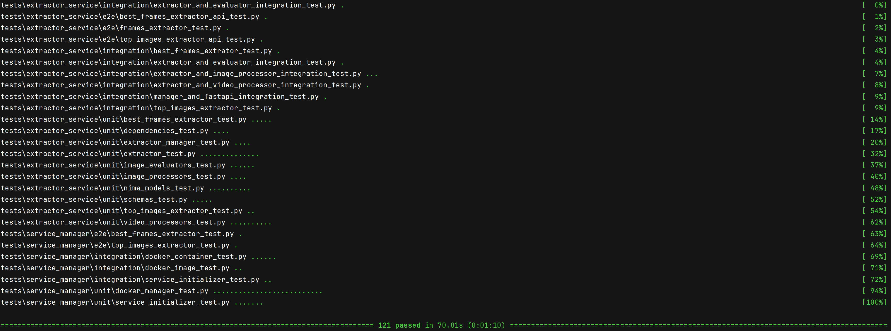

    

    

        
        
        
        
        
        
    

    

        <a href="#about">O projekcie</a> &nbsp;&bull;&nbsp;
        <a href="#key-features">Kluczowe Funkcje</a> &nbsp;&bull;&nbsp;
        <a href="#installation">Instalacja</a> &nbsp;&bull;&nbsp;
        <a href="#usage">Jak używać</a> &nbsp;&bull;&nbsp;
        <a href="#contributions">Contribute</a> &nbsp;&bull;&nbsp;
        <a href="#feedback">Feedback</a> &nbsp;&bull;&nbsp;
        <a href="#licence">Licencja</a>
    

    

        <a href="/README.md">English</a> &nbsp;&bull;&nbsp;
        <a href="/README.pl.md">Polski</a>
    

    W świecie przesyconym treściami wideo, każda sekunda ma potencjał, by stać się niezapomnianym ujęciem.
    <code>PerfectFrameAI</code> to narzędzie wykorzystujące sztuczną inteligencję do analizowania materiałów wideo
    i automatycznego zapisywania najładniejszych klatek.

    <h2>🔎 Demo</h2>
    
    
Full demo: <a href="https://youtu.be/FX1modlxeWA">https://youtu.be/FX1modlxeWA</a>

    

    <h2>🔑 Kluczowe funkcje:</h2>
    

        

            <strong>Best Frames Extraction 🎞️➜🖼️</strong>
            <blockquote>Wybieranie najlepszych klatek z plików video.</blockquote>
        

        
        <ol>
            
Input: Folder z plikami video.

            <li>Bierze pierwsze video ze wskazanej lokalizacji.</li>
            <li>
                Dzieli wideo na klatki.
                Klatki są brane co 1 sekundę wideo.
                Klatki są przetwarzane w batchach(seriach).
            </li>
            <li>Ocenia wszystkie klatki w batchu za pomocą modelu AI i nadaje im ocenę liczbową.</li>
            <li>Dzieli batch klatek na mniejsze grupy.</li>
            <li>Wybiera klatkę z najwyższą oceną liczbową z każdej grupy.</li>
            <li>Zapisuje klatki z najlepszymi ocenami w wybranej lokalizacji. </li>
            
Output: Klatki zapisane jako <code>.jpg</code>.

        </ol>
    

     
    

        

            <strong>Top Images Extraction 🖼️➜🖼️</strong>
            <blockquote>Wybieranie najlepszych obrazów z folderu z obrazami.</blockquote>
        

        
        <ol>
            
Input: Folder z obrazami.

            <li>Wczytuje obrazy. Obrazy są przetwarzane batchach(seriach).</li>
            <li>Ocenia wszystkie obrazy w batchu za pomocą modelu AI i nadaje im ocenę liczbową.</li>
            <li>
                Oblicza, jaki wynik musi mieć obraz, żeby znaleźć się w top 90% obrazów.
                W <code>schemas.py</code> można zmienić tę wartość - <code>top_images_percent</code>.
            </li>
            <li>Zapisuje obrazy o  w wybranej lokalizacji. </li>
            
Output: Obrazy zapisane jako <code>.jpg</code>.

        </ol>
    

     
    

        

            <strong>🆕 Frames Extraction 🖼️🖼️🖼️</strong>
            <blockquote>Zamienia pliki video na klatki.</blockquote>
        

        
Modyfikuje <code>best_frames_extractor</code> poprzez pominięcie części z AI/ocenianiem klatek.

        <pre>curl -X POST http://localhost:8100/v2/extractors/best_frames_extractor \
  -H "Content-Type: application/json" \
  -d '{"all_frames": true}'</pre>
        <ol>
            
Input: Folder z plikami video.

            <li>Bierze pierwsze video ze wskazanej lokalizacji.</li>
            <li>
                Dzieli wideo na klatki. Klatki są brane co 1 sekundę wideo.
                Klatki są przetwarzane w batchach(seriach).
            </li>
            <li>Zapisuje wszystkie klatki w wybranej lokalizacji.</li>
            
Output: Klatki zapisane jako <code>.jpg</code>.

        </ol>
    

    <h2>💿 Instalacja</h2>
    <blockquote>
        <h3 >Wymagania systemowe:</h3>
        <ul>
            <li>Docker & Docker Compose</li>
            <li>8GB+ RAM</li>
            <li>10 GB wolnego miejsca na dysku</li>
        </ul>
        
Najniższe przetestowane specyfikacje - i5-4300U, 8GB RAM (ThinkPad T440) - wideo 4k, domyślnie 100 obrazów/batch.

        
Pamiętaj, że zawsze możesz zmniejszyć rozmiar batcha w schemas.py, jeśli brakuje Ci RAMu.

    </blockquote>
    

        
Zainstaluj Docker:

        Docker Desktop: <a href="https://www.docker.com/products/docker-desktop/">https://www.docker.com/products/docker-desktop/</a>
    

    

        
Pobierz <code>PerfectFrameAI</code>

        <blockquote>
            Aby pobrać kod z repozytorium na GitHubie, kliknij przycisk <code>Code</code>,
            a następnie wybierz <code>Download ZIP</code>
            lub skopiuj adres URL i użyj polecenia <code>git clone</code> w terminalu.
        </blockquote>
        
    

    <h2>⚡ Użycie:</h2>
    
Dokumentacja Docker Compose: <a href="https://docs.docker.com/compose/">https://docs.docker.com/compose/</a>

    <h3>Szybki start</h3>
    <ol>
        <li>
            <strong>Umieść pliki wideo w katalogu wejściowym:</strong>
            <pre>cp ~/twoje_wideo.mp4 ./input_directory/</pre>
        </li>
        <li>
            <strong>Uruchom serwis:</strong>
            <pre># Tryb CPU (domyślny)
docker-compose up --build

# Tryb GPU (wymaga NVIDIA Docker)
docker-compose --profile gpu up --build</pre>
        </li>
        <li>
            <strong>Wywołaj ekstraktor (w nowym terminalu):</strong>
            <pre># Best Frames Extraction
curl -X POST http://localhost:8100/v2/extractors/best_frames_extractor

# Top Images Extraction
curl -X POST http://localhost:8100/v2/extractors/top_images_extractor

# Sprawdź status
curl http://localhost:8100/health

# Sprawdź aktualny status
curl http://localhost:8100/v2/status</pre>
        </li>
        <li>
            <strong>Znajdź wyniki:</strong>
            <pre>ls ./output_directory/</pre>
        </li>
        <li>
            <strong>Zatrzymaj serwis:</strong>
            <pre>docker-compose down</pre>
        </li>
    </ol>
    <h3>Własne katalogi</h3>
    
Możesz określić własne katalogi wejściowe/wyjściowe używając zmiennych środowiskowych:

    <pre>INPUT_DIR=/sciezka/do/input OUTPUT_DIR=/sciezka/do/output docker-compose up --build</pre>
    <h3>Endpointy API</h3>
    <table>
        <thead>
            <tr>
                <th>Endpoint</th>
                <th>Metoda</th>
                <th>Opis</th>
            </tr>
        </thead>
        <tbody>
            <tr>
                <td><code>/health</code></td>
                <td>GET</td>
                <td>Endpoint sprawdzający stan serwisu</td>
            </tr>
            <tr>
                <td><code>/v2/status</code></td>
                <td>GET</td>
                <td>Sprawdź aktualny status ekstraktora</td>
            </tr>
            <tr>
                <td><code>/v2/extractors/best_frames_extractor</code></td>
                <td>POST</td>
                <td>Wyodrębnij najlepsze klatki z wideo</td>
            </tr>
            <tr>
                <td><code>/v2/extractors/top_images_extractor</code></td>
                <td>POST</td>
                <td>Wybierz najlepsze obrazy z folderu</td>
            </tr>
        </tbody>
    </table>
    <h3>Opcje Body Żądania</h3>
    
Dla <code>best_frames_extractor</code>:

    <pre>curl -X POST http://localhost:8100/v2/extractors/best_frames_extractor \
  -H "Content-Type: application/json" \
  -d '{"all_frames": true}'  # Ustaw na true aby pominąć ocenę AI</pre>

    <h2>💡O projekcie:</h2>
    

        <h3>Spis treści:</h3>
        <ul>
            <li><a href="#how-it-works">Jak to działa</a></li>
            <ul>
                <li><a href="#input">Input modelu</a></li>
                <li><a href="#output">Wyniki oceniania obrazów</a></li>
                <li><a href="#classes">Klasy estetyczne</a></li>
                <li><a href="#calculating-mean">Obliczanie ostatecznej oceny obrazu</a></li>
            </ul>
            <li><a href="#implementation">Implementacja w skrócie</a></li>
            <ul>
                <li><a href="#model-architecture">Architektura modelu</a></li>
                <li><a href="#weights">Wagi modelu</a></li>
                <li><a href="#normalization">Normalizacja obrazów</a></li>
                <li><a href="#predictions">Przewidywanie przynależności do klas</a></li>
                <li><a href="#mean-calculation">Obliczanie średniej ważonej</a></li>
            </ul>
            <li><a href="#1vs2">v1.0 vs v2.0</a></li>
            <li><a href="#architecture">Architektura</a></li>
            <li><a href="#build-with">Użyte technologie</a></li>
            <li><a href="#tests">Testy</a></li>
            <ul>
                <li><a href="#unit">Jednostkowe</a></li>
                <li><a href="#integration">Integracyjne</a></li>
                <li><a href="#e2e">E2E</a></li>
            </ul>
        </ul>
    

    

    <h2>📐 Jak to działa</h2>
    

        Narzędzie używa modelu zbudowanego zgodnie z zasadami dla modeli
        Neural Image Assessment (NIMA) do określania estetyki obrazów.
    

    
    

       
<strong>Input modelu</strong>

       
Model przyjmuje odpowiednio znormalizowane obrazy w batchu Tensor.

    

    <h3 id="output">Wyniki oceniania obrazów</h3>
    

    Model NIMA, po przetworzeniu obrazów, zwraca wektory prawdopodobieństw, 
    gdzie każda z wartość w wektorze odpowiada prawdopodobieństwu, 
    że obraz przynależy do jednej z klas estetycznych.
    

    

        
<strong>Klasy estetyczne</strong>

        

            Jest 10 klas estetycznych. W modelu NIMA każda z 10 klas odpowiada
            określonemu poziomowi estetyki, gdzie:
        

        <ul>
            <li>Klasa 1: Bardzo niska jakość estetyczna.</li>
            <li>Klasa 2: Niska jakość estetyczna.</li>
            <li>Klasa 3: Poniżej średniej jakości estetycznej.</li>
             ...
            <li>Klasa 10: Wyjątkowo wysoka jakość estetyczna.</li>
        </ul>
    

    <h3 id="calculating-mean">Obliczanie ostatecznej oceny obrazu</h3>
    

        Ostateczna ocena obrazu jest obliczana za pomocą średniej
        ważonej z wyników dla każdej z klas, gdzie wagi są 
        wartościami klas od 1 do 10.
    

    <h4>Przykład:</h4>
    

       Załóżmy, że model zwraca następujący wektor 
       prawdopodobieństw dla jednego obrazu:
    

    <pre>[0.1, 0.05, 0.05, 0.1, 0.2, 0.15, 0.1, 0.1, 0.1, 0.05]</pre>
    Oznacza to, że obraz ma:
    <ul>
        <li>10% prawdopodobieństwa przynależności do klasy 1</li>
        <li>5% prawdopodobieństwa przynależności do klasy 2</li>
        <li>5% prawdopodobieństwa przynależności do klasy 3</li>
        <li>i tak dalej...</li>
    </ul>
    

       Obliczając średnią ważoną z tych prawdopodobieństw,
       gdzie wagi to wartości klas (1 do 10):
    

    
    

    

        <h2>📖 Implementacja w skrócie</h2>
        
        

            
<strong>Architektura modelu</strong>

            

                Model NIMA używa architektury InceptionResNetV2 jako swojej podstawy.
                Ta architektura jest znana ze swojej wysokiej wydajności w zadaniach
                klasyfikacji obrazów.
            

        

        

            
<strong>Wagi modelu</strong>

            

                Model korzysta z wcześniej wytrenowanych wag,
                wytrenowanych na dużym zbiorze danych (AVA dataset) obrazów
                ocenionych pod kątem ich jakości estetycznej.
                Narzędzie automatycznie pobiera wagi i przechowuje je
                w voluminie Docker do dalszego użytkowania.
            

        

        

            
<strong>Normalizacja obrazów</strong>

            

                Przed wprowadzeniem obrazów do modelu, są one normalizowane,
                aby upewnić się, że mają właściwy format i zakres wartości.
            

        

        

            
<strong>Przewidywanie przynależności do klas</strong>

            

                Model przetwarza obrazy i zwraca wektor 10 prawdopodobieństw,
                z których każde reprezentuje prawdopodobieństwo przynależności
                obrazu do jednej z 10 klas jakości estetycznej
                (od 1 dla najniższej jakości do 10 dla najwyższej jakości).
            

        

        

            
<strong>Obliczanie średniej ważonej</strong>

            

                Ostateczny wynik estetyczny dla obrazu jest obliczany
                jako średnia ważona tych prawdopodobieństw,
                przy czym wyższe klasy mają większe wagi.
            

        

    

    

        <h2>✅ v1.0 vs v2.0</h2>
        

            <code>PerfectFrameAI</code> to narzędzie stworzone na podstawie jednego z mikro serwisów mojego głównego projektu. 
            Określam tamtą wersję jako <code>v1.0</code>.
        

        <table>
            <tr>
                <th>Feature</th>
                <th>v1.0</th>
                <th>v2.0</th>
            </tr>
            <tr>
                <td>CLI</td>
                <td class="cross">❌</td>
                <td class="check">✅</td>
            </tr>
            <tr>
                <td>Zautomatyzowana instalacja</td>
                <td class="cross">❌</td>
                <td class="check">✅</td>
            </tr>
            <tr>
                <td>Szybki i Prosty Setup</td>
                <td class="cross">❌</td>
                <td class="check">✅</td>
            </tr>
            <tr>
                <td>Optymalizacja zużycia RAMu</td>
                <td class="cross">❌</td>
                <td class="check">✅</td>
            </tr>
            <tr>
                <td>Wydajność</td>
                <td>+0%</td>
                <td>+70%</td>
            </tr>
            <tr>
                <td>Rozmiar*</td>
                <td class="cross">12.6 GB</td>
                <td class="check">8.4 GB</td>
            </tr>
            <tr>
                <td>Open Source</td>
                <td class="cross">❌</td>
                <td class="check">✅</td>
            </tr>
        </table>
        
*v1.0 wszystkie zależności i model vs v2.0 docker image + model

        <h3>Porównanie wydajności:</h3>
        <ul>
            <h4>Platforma:</h4>
            <li>RTX3070ti (8GB)</li>
            <li>i5-13600k</li>
            <li>32GB RAM</li>
        </ul>
        
    

    

        <h2>Architektura</h2>
        
    

    

    <h2>🛠️ Użyte technologie</h2>
    <ul>
        <li>Python - główny język w którym jest napisany projekt.</li>
        <li>FastAPI - framework na którym została zbudowana główna część <code>PerfectFrameAI</code> (w v1.0 Flask).</li>
        <li>OpenCV - do manipulacji obrazami.</li>
        <li>numpy - do operacji na tablicach wielowymiarowych.</li>
        <li>FFMPEG - jako rozszerzenie do OpenCV, do dekodowania klatek video.</li>
        <li>CUDA - do umożliwienia wykonywania operacji na kartach graficznych.</li>
        <li>Tensorflow - wykorzystywana biblioteka do uczenia maszynowego (w v1.0 PyTorch).</li>
        <li>Docker & Docker Compose - dla ułatwienia budowania i uruchamiania <code>PerfectFrameAI</code>.</li>
        <li>pytest - framework w którym napisane są testy.</li>
        <li>testcontainers - do testowania E2E z Dockerem.</li>
        <li>uv - do zarządzania zależnościami projektu.</li>
        <blockquote>Wszystkie używane zależności dostępne są w <a href="https://github.com/BKDDFS/PerfectFrameAI/blob/main/pyproject.toml">pyproject.toml.</a></blockquote>
    </ul>
    

    

        <h2>🧪 Testy</h2>
        
        

            Testy możesz uruchomić instalując zależności z <code>pyproject.toml</code>
            i wpisując w terminal w lokalizacji projektu - <code>pytest</code>.
        

        <pre># Zainstaluj zależności
uv sync --all-extras

# Uruchom testy extractor_service (jednostkowe + integracyjne)
pytest tests/extractor_service -v

# Uruchom testy E2E (wymaga Dockera)
pytest tests/service_manager/e2e -v</pre>
        

            
jednostkowe

            

            Każdy moduł ma swoje testy jednostkowe.
            Testują one każdą z metod i funkcji dostępnych w modułach.
            Test coverage wynosi 100% (testy w całości pokrywają logikę biznesową).
            

        

        

            
integracyjne

            <ul>
                <li>Testowanie integracji logiki biznesowej z modelem NIMA.</li>
                <li>Testowanie integracji z FastAPI.</li>
                <li>Testowanie integracji z OpenCV.</li>
                <li>Testowanie integracji z FFMPEG.</li>
                <li>Testowanie integracji modułów między sobą na różne sposoby...</li>
            </ul>
        

        

            
e2e

            <ul>
                <li>Testowanie działania extractor_service jako całość używając FastAPI TestClient.</li>
                <li>Testowanie pełnego serwisu opartego na Docker używając testcontainers.</li>
            </ul>
        

    

    <h2>🎯 Roadmapa</h2>
        

            Poniżej znajduje się lista funkcji, które planujemy zaimplementować w nadchodzących wersjach.
            Zapraszamy do współpracy i sugestii społeczność.
        

        <ul>
            <li>
                Implementacja Nvidia DALI.
                <ul>
                    <li>Umożliwi przeniesienie dekodowania klatek (obecnie najdłuższej części) na GPU.</li>
                    <li>Dodatkowo umożliwi operowanie od razu na obiektach Tensor bez dodatkowych konwersji.</li>
                </ul>
                Podsumowując, dodanie DALI powinno być kolejnym poważnym krokiem naprzód,
                jeśli chodzi o poprawę wydajności.
            </li>
            <li>
                Naprawienie spillingu danych podczas oceniania klatek. 
                Obecnie ocenianie ma delikatne spowolnienie w postaci problemu ze spillingiem.
            </li>
        </ul>

    <h2>👋 Jak zostać Contributorem</h2>
    

        Jeśli jesteś zainteresowany wkładem w ten projekt,
        proszę poświęć chwilę na przeczytanie naszego 
        <a href="https://github.com/BKDDFS/PerfectFrameAI/blob/main/.github/CONTRIBUTING.md">Przewodnika dla contributorów</a>.
        Zawiera on wszystkie informacje potrzebne do rozpoczęcia, takie jak:
    

    <ul>
        <li>Jak zgłaszać błędy i składać prośby o nowe funkcje</li>
        <li>Nasze standardy i wytyczne dotyczące kodowania</li>
        <li>Instrukcje dotyczące konfiguracji środowiska developerskiego</li>
        <li>Proces składania pull requestów</li>
    </ul>
    

        Twój wkład pomaga uczynić ten projekt lepszym, doceniamy twoje wysiłki. Dziękujemy za wsparcie!
    

    <h2>❤️ Feedback</h2>
    

        Będę bardzo wdzięczny za feedback na temat jakości mojego kodu i tego projektu. 
        Jeśli masz jakieś sugestie, proszę:
    

    <ul>
        <li>Zostaw komentarze na konkretnych liniach kodu za pomocą pull requestów.</li>
        <li>
            Stwórz <a href="https://github.com/BKDDFS/PerfectFrameAI/issues">Issue</a>,
            aby omówić większe zmiany lub ogólne sugestie.
        </li>
        <li>Weź udział w dyskusjach w sekcji „Dyskusje” tego repozytorium.</li>
    </ul>
    <blockquote>W celu bezpośredniej komunikacji, możesz skontaktować się ze mną pod adresem <a href="mailto:Bartekdawidflis@gmail.com">Bartekdawidflis@gmail.com</a>.</blockquote>

    <h2>⭐️ Wsparcie</h2>
    
Nie zapomnij zostawić gwiazdki ⭐️.

    <h2>🗃️ Biografia</h2>
    Oryginalna publikacja Google Brains przedstawiająca NIMA: 
    <a href="https://research.google/blog/introducing-nima-neural-image-assessment/">https://research.google/blog/introducing-nima-neural-image-assessment/</a> 
    Wagi do modelu: 
    <a href="https://github.com/titu1994/neural-image-assessment">https://github.com/titu1994/neural-image-assessment</a>

    <h2>📜 Licencja</h2>
    

        PerfectFrameAI jest licencjonowany na podstawie licencji GNU General Public License v3.0.
        Więcej informacji znajdziesz w pliku <a href="https://github.com/BKDDFS/PerfectFrameAI/blob/main/LICENSE">LICENSE</a>.
    

