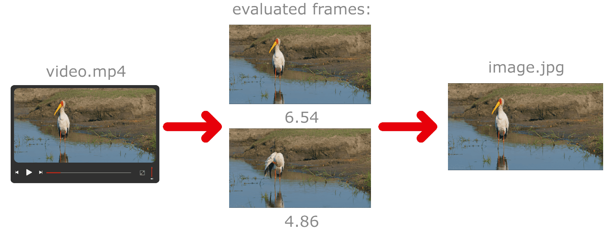
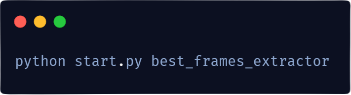
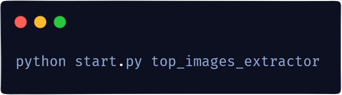
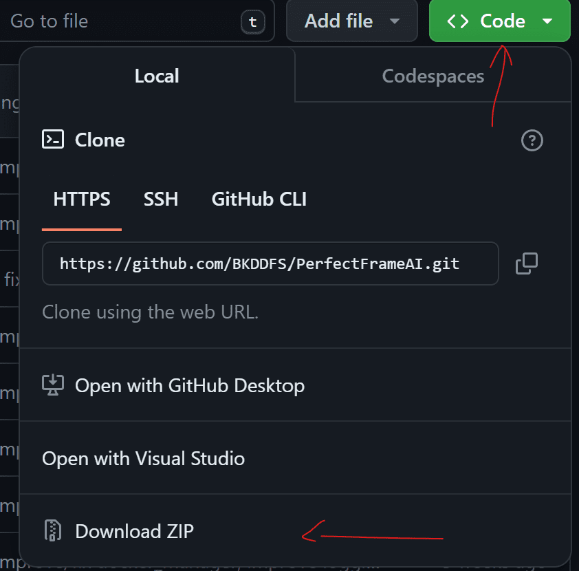
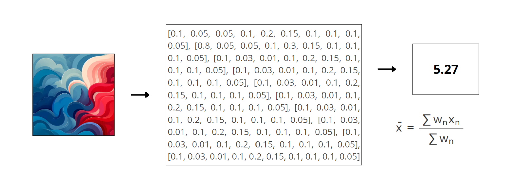
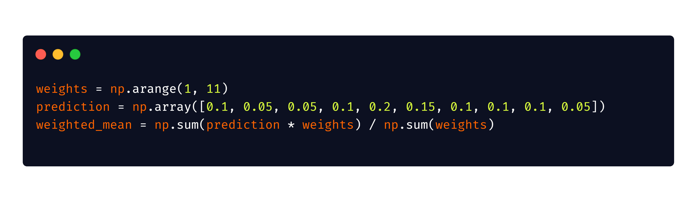
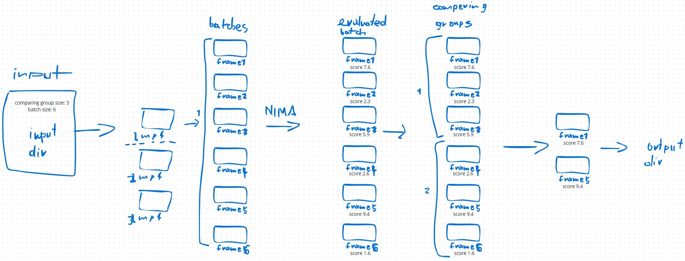
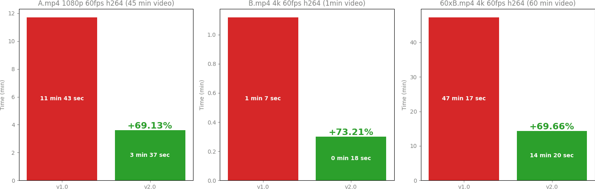
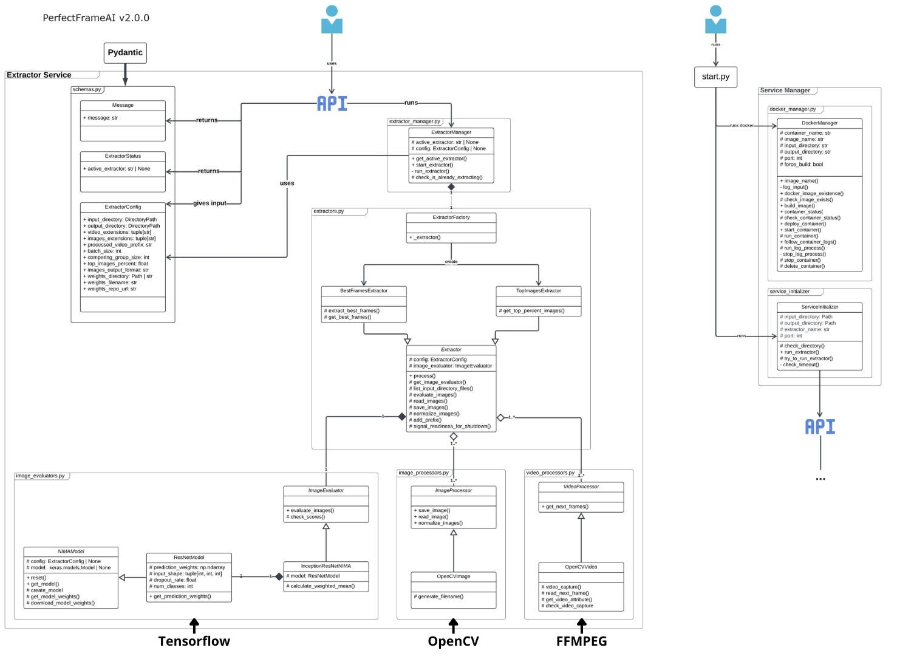

    

    

        
        
        
        
        
        
    

    

        <a href="#about">About</a> &nbsp;&bull;&nbsp;
        <a href="#key-features">Key Features</a> &nbsp;&bull;&nbsp;
        <a href="#installation">Installation</a> &nbsp;&bull;&nbsp;
        <a href="#usage">Usage</a> &nbsp;&bull;&nbsp;
        <a href="#contribute">Contribute</a> &nbsp;&bull;&nbsp;
        <a href="#feedback">Feedback</a> &nbsp;&bull;&nbsp;
        <a href="#licence">License</a>
    

    In a world saturated with video content, every second has the potential to become an unforgettable shot.
    <code>PerfectFrameAI</code> is a tool that uses artificial intelligence to analyze video materials
    and automatically save the best frames.

    <h2>🔎 Demo</h2>
    
    
Full demo: <a href="https://youtu.be/FX1modlxeWA">https://youtu.be/FX1modlxeWA</a>

    

    <h2>🔑 Key Features:</h2>
    

        

            <strong>Best Frames Extraction 🎞️➜🖼️</strong>
            <blockquote>Selecting the best frames from video files.</blockquote>
        

        
        <ol>
            
Input: Folder with video files.

            <li>Takes the first video from the specified location.</li>
            <li>
                Splits the video into frames.
                Frames are taken at 1-second intervals.
                Frames are processed in batches.
            </li>
            <li>Evaluates all frames in the batch using an AI model and assigns them a numerical score.</li>
            <li>Divides the batch of frames into smaller groups.</li>
            <li>Selects the frame with the highest numerical score from each group.</li>
            <li>Saves the frames with the best scores in the chosen location.</li>
            
Output: Frames saved as <code>.jpg</code>.

        </ol>
    

     
    

        

            <strong>Top Images Extraction 🖼️➜🖼️</strong>
            <blockquote>Selecting the best images from a folder of images.</blockquote>
        

        
        <ol>
            
Input: Folder with images.

            <li>Loads the images. Images are processed in batches.</li>
            <li>Evaluates all images in the batch using an AI model and assigns them a numerical score.</li>
            <li>
                Calculates the score an image must have to be in the top 90% of images.
                This value can be changed in <code>schemas.py</code> - <code>top_images_percent</code>.
            </li>
            <li>Saves the top images in the chosen location.</li>
            
Output: Images saved as <code>.jpg</code>.

        </ol>
    

     
    

        

            <strong>🆕 Frames Extraction 🖼️🖼️🖼️</strong>
            <blockquote>Extract and return frames from a video.</blockquote>
        

        
Modifying <code>best_frames_extractor</code> by skipping AI evaluation part.

        <pre>curl -X POST http://localhost:8100/v2/extractors/best_frames_extractor \
  -H "Content-Type: application/json" \
  -d '{"all_frames": true}'</pre>
        <ol>
            
Input: Folder with video files.

            <li>Takes the first video from the specified location.</li>
            <li>
                Splits the video into frames.
                Frames are taken at 1-second intervals.
                Frames are processed in batches.
            </li>
            <li>Saves all frames in the chosen location.</li>
            
Output: Frames saved as <code>.jpg</code>.

        </ol>
    

    <h2>💿 Installation</h2>
    <blockquote>
        <h3>System Requirements:</h3>
        <ul>
            <li>Docker & Docker Compose</li>
            <li>8GB+ RAM</li>
            <li>10GB+ free disk space</li>
        </ul>
        
Lowest tested specs - i5-4300U, 8GB RAM (ThinkPad T440) - 4k video, default 100img/batch.

        
Remember you can always decrease images batch size in schemas.py if you out of RAM.

    </blockquote>
    

        
Install Docker:

        Docker Desktop: <a href="https://www.docker.com/products/docker-desktop/">https://www.docker.com/products/docker-desktop/</a>
    

    

        
Download <code>PerfectFrameAI</code>

        

            To download the code from the GitHub repository, click the <code>Code</code> button,
            then select <code>Download ZIP</code>
            or copy the URL and use the <code>git clone</code> command in the terminal.
        

        
    

    <h2>⚡ Usage</h2>
    
Docker Compose Docs: <a href="https://docs.docker.com/compose/">https://docs.docker.com/compose/</a>

    

        

            <strong>🚀 Quick Start</strong>
            <blockquote>Get started in 4 steps.</blockquote>
        

        <ol>
            <li>
                <strong>Place video files in input directory:</strong> 
                <code>cp ~/your_video.mp4 ./input_directory/</code>
            </li>
            <li>
                <strong>Start the service:</strong> 
                <code>docker-compose up --build</code>
            </li>
            <li>
                <strong>Call the extractor (in a new terminal):</strong> 
                <code>curl -X POST http://localhost:8100/v2/extractors/best_frames_extractor</code>
            </li>
            <li>
                <strong>Find results in:</strong> 
                <code>./output_directory/</code>
            </li>
        </ol>
    

     
    

        

            <strong>💻 CPU Mode</strong>
            <blockquote>Default mode - works on any system with Docker.</blockquote>
        

        
Start the service:

        <code>docker-compose up --build</code>
        
Stop the service:

        <code>docker-compose down</code>
    

     
    

        

            <strong>🎮 GPU Mode</strong>
            <blockquote>NVIDIA GPU acceleration for faster processing.</blockquote>
        

        
<strong>Requirements:</strong>

        <ul>
            <li>NVIDIA GPU with CUDA support</li>
            <li>NVIDIA drivers installed on host</li>
            <li><a href="https://docs.nvidia.com/datacenter/cloud-native/container-toolkit/install-guide.html">NVIDIA Container Toolkit</a></li>
        </ul>
        
<strong>Running:</strong>

        
Start with GPU support:

        <code>docker-compose --profile gpu up --build</code>
        
Verify GPU is being used (check logs for CUDA provider):

        <code>docker-compose --profile gpu logs</code>
        
Stop the service:

        <code>docker-compose --profile gpu down</code>
        
<i>If CUDA is not available, the application will automatically fall back to CPU.</i>

    

     
    

        

            <strong>📁 Custom Directories</strong>
            <blockquote>Specify custom input/output paths.</blockquote>
        

        
Use environment variables:

        <code>INPUT_DIR=/path/to/input OUTPUT_DIR=/path/to/output docker-compose up --build</code>
    

     
    

        

            <strong>🔌 API Endpoints</strong>
            <blockquote>Available HTTP endpoints.</blockquote>
        

        <table>
            <thead>
                <tr>
                    <th>Endpoint</th>
                    <th>Method</th>
                    <th>Description</th>
                </tr>
            </thead>
            <tbody>
                <tr>
                    <td><code>/health</code></td>
                    <td>GET</td>
                    <td>Health check endpoint</td>
                </tr>
                <tr>
                    <td><code>/v2/status</code></td>
                    <td>GET</td>
                    <td>Check current extractor status</td>
                </tr>
                <tr>
                    <td><code>/v2/extractors/best_frames_extractor</code></td>
                    <td>POST</td>
                    <td>Extract best frames from videos</td>
                </tr>
                <tr>
                    <td><code>/v2/extractors/top_images_extractor</code></td>
                    <td>POST</td>
                    <td>Select top images from a folder</td>
                </tr>
            </tbody>
        </table>
        
<strong>Example requests:</strong>

        <ul>
            <li>Best Frames Extraction: <code>curl -X POST http://localhost:8100/v2/extractors/best_frames_extractor</code></li>
            <li>Top Images Extraction: <code>curl -X POST http://localhost:8100/v2/extractors/top_images_extractor</code></li>
            <li>Skip AI evaluation (extract all frames): <code>curl -X POST http://localhost:8100/v2/extractors/best_frames_extractor -H "Content-Type: application/json" -d '{"all_frames": true}'</code></li>
        </ul>
    

    <h2>💡 About:</h2>
    

        <h3>Table of Contents:</h3>
        <ul>
            <li><a href="#how-it-works">How it works</a></li>
            <ul>
                <li><a href="#input">Model Input</a></li>
                <li><a href="#output">Image Rating Results</a></li>
                <li><a href="#classes">Aesthetic Classes</a></li>
                <li><a href="#calculating-mean">Calculating the Final Image Score</a></li>
            </ul>
            <li><a href="#implementation">Implementation in Brief</a></li>
            <ul>
                <li><a href="#model-architecture">Model Architecture</a></li>
                <li><a href="#weights">Pre-trained Weights</a></li>
                <li><a href="#normalization">Image Normalization</a></li>
                <li><a href="#predictions">Class Predictions</a></li>
                <li><a href="#mean-calculation">Weighted Mean Calculation</a></li>
            </ul>
            <li><a href="#1vs2vs3">v1.0 vs v2.0 vs v3.0</a></li>
            <li><a href="#architecture">Architecture</a></li>
            <li><a href="#tests">Tests</a></li>
            <ul>
                <li><a href="#unit">unit</a></li>
                <li><a href="#integration">integration</a></li>
                <li><a href="#e2e">e2e</a></li>
            </ul>
        </ul>
    

    

    <h2>📐 How it Works</h2>
    

    The tool uses a model built according to the principles
    of Neural Image Assessment (NIMA) models to determine the
    aesthetics of images.
    

    
    

       
<strong>Model Input</strong>

       
The model accepts properly normalized images in a Tensor batch.

    

    <h3 id="output">Image Rating Results</h3>
    

    The NIMA model, after processing the images, returns probability vectors,
    where each value in the vector corresponds to the probability
    that the image belongs to one of the aesthetic classes.
    

    

        
<strong>Aesthetic Classes</strong>

        

            There are 10 aesthetic classes. In the NIMA model, each of the 10 classes corresponds
            to a certain level of aesthetics, where:
        

        <ul>
            <li>Class 1: Very low aesthetic quality.</li>
            <li>Class 2: Low aesthetic quality.</li>
            <li>Class 3: Below average aesthetic quality.</li>
             ...
            <li>Class 10: Exceptionally high aesthetic quality.</li>
        </ul>
    

    <h3 id="calculating-mean">Calculating the Final Image Score</h3>
    

        The final image score is calculated using the weighted mean
        of the scores for each class, where the weights are
        the class values from 1 to 10.
    

    <h4>Example:</h4>
    

       Suppose the model returns the following probability vector for one image:
    

    <pre>[0.1, 0.05, 0.05, 0.1, 0.2, 0.15, 0.1, 0.1, 0.1, 0.05]</pre>
    This means that the image has:
    <ul>
        <li>10% probability of belonging to class 1</li>
        <li>5% probability of belonging to class 2</li>
        <li>5% probability of belonging to class 3</li>
        <li>and so on...</li>
    </ul>
    

       By calculating the weighted mean of these probabilities,
       where the weights are the class values (1 to 10):
    

    
    

    

        <h2>📖 Implementation in Brief</h2>
        
        

            
<strong>Model Architecture</strong>

            
The NIMA model uses the InceptionResNetV2 architecture as its base. This architecture is known for its high performance in image classification tasks.

        

        

            
<strong>Pre-trained Weights</strong>

            
The model uses pre-trained weights that have been trained on a large dataset (AVA dataset) of images rated for their aesthetic quality. The tool automatically downloads the weights and stores them in a Docker volume for further use.

        

        

            
<strong>Image Normalization</strong>

            
Before feeding images into the model, they are normalized to ensure they are in the correct format and value range.

        

        

            
<strong>Class Predictions</strong>

            
The model processes the images and returns a vector of 10 probabilities, each representing the likelihood of the image belonging to one of the 10 aesthetic quality classes (from 1 for the lowest quality to 10 for the highest quality).

        

        

            
<strong>Weighted Mean Calculation</strong>

            
The final aesthetic score for an image is calculated as the weighted mean of these probabilities, with higher classes having greater weights.

        

    

    

        <h2>✅ v1.0 vs v2.0 vs v3.0</h2>
        

            <code>PerfectFrameAI</code> is a tool created based on one of the microservices of my main project.
            I refer to that version as <code>v1.0</code>.
        

        <table >
            <tr>
                <th>Feature</th>
                <th>v1.0</th>
                <th>v2.0</th>
                <th>v3.0</th>
            </tr>
            <tr>
                <td>CLI</td>
                <td class="cross">❌</td>
                <td class="check">✅</td>
                <td class="check">✅</td>
            </tr>
            <tr>
                <td>Automatic Installation</td>
                <td class="cross">❌</td>
                <td class="check">✅</td>
                <td class="check">✅</td>
            </tr>
            <tr>
                <td>Fast and Easy Setup</td>
                <td class="cross">❌</td>
                <td class="check">✅</td>
                <td class="check">✅</td>
            </tr>
            <tr>
                <td>RAM usage optimization</td>
                <td class="cross">❌</td>
                <td class="check">✅</td>
                <td class="check">✅</td>
            </tr>
            <tr>
                <td>Performance</td>
                <td>+0%</td>
                <td>+70%</td>
                <td>~+100%</td>
            </tr>
            <tr>
                <td>Open Source</td>
                <td class="cross">❌</td>
                <td class="check">✅</td>
                <td class="check">✅</td>
            </tr>
            <tr>
                <td>Multiplatform</td>
                <td class="cross">❌</td>
                <td class="cross">❌</td>
                <td class="check">✅</td>
            </tr>
            <tr>
                <td>License</td>
                <td>Proprietary</td>
                <td>GPL v3</td>
                <td>Apache 2.0</td>
            </tr>
        </table>
        <h3>Performance tests comparision</h3>
        <ul>
            <h4>Platform:</h4>
            <li>RTX3070ti (8GB)</li>
            <li>i5-13600k</li>
            <li>32GB RAM</li>
        </ul>
        
    

    

        <h2>Architecture</h2>
        
    

    <h2>👋 How to Contribute</h2>
    

        If you're interested in contributing to this project,
        please take a moment to read our <a href="https://github.com/BKDDFS/PerfectFrameAI/blob/main/.github/CONTRIBUTING.md">Contribution Guide</a>. It includes all the information you need to get started, such as:
    

    <ul>
        <li>How to report bugs and submit feature requests.</li>
        <li>Our coding standards and guidelines.</li>
        <li>Instructions for setting up your development environment.</li>
        <li>The process for submitting pull requests.</li>
    </ul>
    

        Your contributions help make this project better, and we appreciate your efforts. Thank you for your support!
    

    <h2>❤️ Feedback</h2>
    
I am looking for feedback on the code quality and design of this project. If you have any suggestions on how to improve the code, please feel free to:

    <ul>
        <li>Leave comments on specific lines of code via pull requests.</li>
        <li>Open an <a href="https://github.com/BKDDFS/PerfectFrameAI/issues">Issue</a> to discuss larger changes or general suggestions.</li>
        <li>Participate in discussions in the 'Discussions' section of this repository.</li>
    </ul>
    
Your insights are invaluable and greatly appreciated, as they will help improve both the project and my skills as a developer.

    <blockquote>For more direct communication, you can reach me at <a href="Bartekdawidflis@gmail.com">Bartekdawidflis@gmail.com</a>.</blockquote>

    <h2>⭐️ Support</h2>
    
Don't forget to leave a star ⭐️.

    <h2>🗃️ References</h2>
    Original Google Brains publication introducing NIMA: 
    <a href="https://research.google/blog/introducing-nima-neural-image-assessment/">https://research.google/blog/introducing-nima-neural-image-assessment/</a> 
    Pre-trained weights: 
    <a href="https://github.com/titu1994/neural-image-assessment">https://github.com/titu1994/neural-image-assessment</a>

    <h2>📜 License</h2>
    

        PerfectFrameAI is licensed under the Apache License 2.0.
        See the <a href="https://github.com/BKDDFS/PerfectFrameAI/blob/main/LICENSE">LICENSE</a> file for more information.
    

