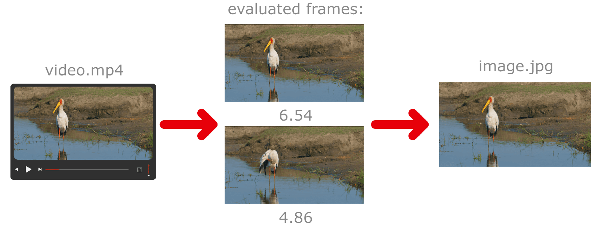
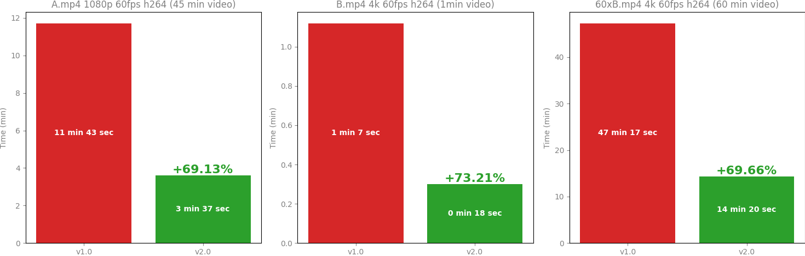
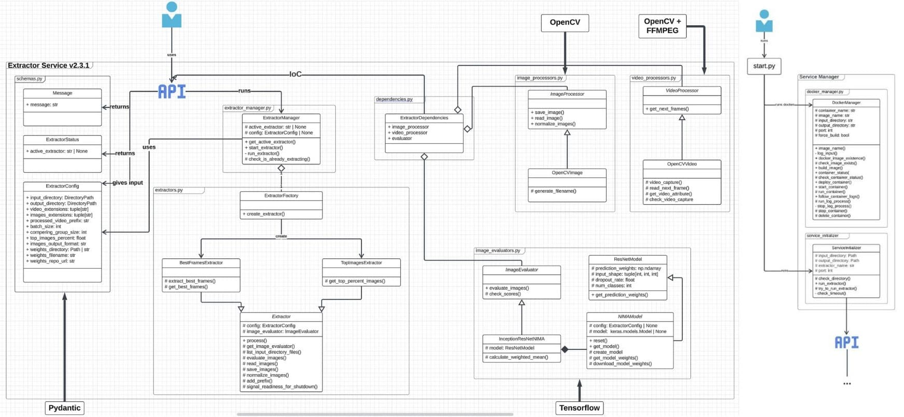

    

    

        
        
        
        
        
    

    

        <a href="#about">About</a> &nbsp;&bull;&nbsp;
        <a href="#key-features">Key Features</a> &nbsp;&bull;&nbsp;
        <a href="#installation">Installation</a> &nbsp;&bull;&nbsp;
        <a href="#usage">Usage</a> &nbsp;&bull;&nbsp;
        <a href="#contribute">Contribute</a> &nbsp;&bull;&nbsp;
        <a href="#feedback">Feedback</a> &nbsp;&bull;&nbsp;
        <a href="#licence">License</a>
    

    

        <a href="https://github.com/BKDDFS/PerfectFrameAI/blob/main/README.md">English</a> &nbsp;&bull;&nbsp;
        <a href="https://github.com/BKDDFS/PerfectFrameAI/blob/main/.github/README.pl.md">Polski</a>
    

    In a world saturated with video content, every second has the potential to become an unforgettable shot.
    <code>PerfectFrameAI</code> is a tool that uses artificial intelligence to analyze video materials
    and automatically save the best frames.

    <h2>🔎 Demo</h2>
    
    
Full demo: <a href="https://youtu.be/FX1modlxeWA">https://youtu.be/FX1modlxeWA</a>

    

    <h2>🔑 Key Features:</h2>
    

        

            <strong>Best Frames Extraction 🎞️➜🖼️</strong>
            <blockquote>Selecting the best frames from video files.</blockquote>
        

        
        <ol>
            
Input: Folder with <code>.mp4</code> video files.

            <li>Takes the first video from the specified location.</li>
            <li>
                Splits the video into frames.
                Frames are taken at 1-second intervals.
                Frames are processed in batches.
            </li>
            <li>Evaluates all frames in the batch using an AI model and assigns them a numerical score.</li>
            <li>Divides the batch of frames into smaller groups.</li>
            <li>Selects the frame with the highest numerical score from each group.</li>
            <li>Saves the frames with the best scores in the chosen location.</li>
            
Output: Frames saved as <code>.jpg</code>.

        </ol>
    

     
    

        

            <strong>Top Images Extraction 🖼️➜🖼️</strong>
            <blockquote>Selecting the best images from a folder of images.</blockquote>
        

        
        <ol>
            
Input: Folder with <code>.jpg</code> images.

            <li>Loads the images. Images are processed in batches.</li>
            <li>Evaluates all images in the batch using an AI model and assigns them a numerical score.</li>
            <li>
                Calculates the score an image must have to be in the top 90% of images.
                This value can be changed in <code>schemas.py</code> - <code>top_images_percent</code>.
            </li>
            <li>Saves the top images in the chosen location.</li>
            
Output: Images saved as <code>.jpg</code>.

        </ol>
    

     
    

        

            <strong>🆕 Frames Extraction 🖼️🖼️🖼️</strong>
            <blockquote>Extract and return frames from a video.</blockquote>
        

        
Modifying <code>best_frames_extractor</code> by skipping AI evaluation part.

        <code>python start.py best_frames_extractor --all_frames</code>
        <ol>
            
Input: Folder with <code>.mp4</code> video files.

            <li>Takes the first video from the specified location.</li>
            <li>
                Splits the video into frames.
                Frames are taken at 1-second intervals.
                Frames are processed in batches.
            </li>
            <li>Saves all frames in the chosen location.</li>
            
Output: Frames saved as <code>.jpg</code>.

        </ol>
    

    <h2>💿 Installation</h2>
    <blockquote>
        <h3>System Requirements:</h3>
        <ul>
            <li>Docker</li>
            <li>Python 3.7+ (method 1 only)</li>
            <li>8GB+ RAM</li>
            <li>10GB+ free disk space</li>
        </ul>
        
Lowest tested specs - i5-4300U, 8GB RAM (ThinkPad T440) - 4k video, default 100img/batch.

        
Remember you can always decrease images batch size in schemas.py if you out of RAM.

    </blockquote>
    

        
Install Docker:

        Docker Desktop: <a href="https://www.docker.com/products/docker-desktop/">https://www.docker.com/products/docker-desktop/</a>
    

    

        
Install Python v3.7+:

        MS Store: <a href="https://apps.microsoft.com/detail/9ncvdn91xzqp?hl=en-US&gl=US">https://apps.microsoft.com/detail/9ncvdn91xzqp?hl=en-US&gl=US</a> 
        Python.org: <a href="https://www.python.org/downloads/">https://www.python.org/downloads/</a>
    

    

        
Download <code>PerfectFrameAI</code>

        

            To download the code from the GitHub repository, click the <code>Code</code> button,
            then select <code>Download ZIP</code>
            or copy the URL and use the <code>git clone</code> command in the terminal.
        

        
    

    <h2>⚡ Usage:</h2>
    

        

            <strong style="font-size: 20px;"> 🚀 Method 1 - CLI </strong>
            <blockquote>
<i>Requires Python. Simple and convenient.</i>
</blockquote>
        

         <blockquote>
            

                <strong>Hint for Windows users:</strong> 
                As a Windows user, you can use: 
                <code>quick_demo_gpu.bat</code> or <code>quick_demo_cpu.bat</code>
                if you don't have an Nvidia GPU. 
                It will run <code>best_frames_extractor</code> with the default values.
                Just double-click on it.
                You can modify the default values in config.py to adjust the application to your needs. 
                <strong>Warning!</strong> 
                Please note that when running the .bat file,
                Windows Defender may flag it as dangerous.
                This happens because obtaining a code-signing certificate
                to prevent this warning requires a paid certificate...
            

        </blockquote>
        
Run <code>start.py</code> from the terminal.

        
<strong>Example (Best Frames Extraction, default values):</strong>

         
        <table id="flags">
            <caption><strong>Available Flags</strong></caption>
            <thead>
                <tr>
                    <th>Flag</th>
                    <th>Short</th>
                    <th>Description</th>
                    <th>Type</th>
                    <th>Default Value</th>
                </tr>
            </thead>
            <tbody>
                <tr>
                    <td>--input_dir</td>
                    <td>-i</td>
                    <td>Change input directory</td>
                    <td>str</td>
                    <td>./input_directory</td>
                </tr>
                <tr>
                    <td>--output_dir</td>
                    <td>-o</td>
                    <td>Change output directory</td>
                    <td>str</td>
                    <td>./output_directory</td>
                </tr>
                <tr>
                    <td>--port</td>
                    <td>-p</td>
                    <td>Change the port the <code>extractor_service</code> will run on</td>
                    <td>int</td>
                    <td>8100</td>
                </tr>
                <tr>
                    <td>--build</td>
                    <td>-b</td>
                    <td>
                        Builds a new Docker image with the new specified settings.
                        Always use with the --build flag if you don't understand.
                    </td>
                    <td>bool</td>
                    <td>False</td>
                </tr>
                <tr>
                    <td>--all_frames</td>
                    <td></td>
                    <td>
                        For skipping frames evaluation part.
                    </td>
                    <td>bool</td>
                    <td>False</td>
                </tr>
                <tr>
                    <td>--cpu</td>
                    <td></td>
                    <td>
                        Uses only CPU for processing. If you, don't have GPU you must use it.
                    </td>
                    <td>bool</td>
                    <td>False</td>
                </tr>
            </tbody>
        </table>
        
<strong>Example (Best Frames Extraction):</strong>
 
        
        
You can edit other default parameters in <code>config.py</code>.

    

    

        

            <strong style="font-size: 20px;">🐳 Method 2 - docker-compose.yaml:</strong>
            <blockquote>
<i>Does not require Python. Run using Docker Compose.</i>
</blockquote>
        

        
Docker Compose Docs: <a href="https://docs.docker.com/compose/">https://docs.docker.com/compose/</a>

        
Remember to delete GPU part in docker-compose.yaml if you don't have GPU!

        <ol>
            <li>Run the service:  <code>docker-compose up --build -d</code></li>
            <li>Send a request to the chosen endpoint.
            
<strong>Example requests:</strong>

                <ul>
                    <li>Best Frames Extraction: <code>POST http://localhost:8100/extractors/best_frames_extractor</code></li>
                    <li>Top Frames Extraction: <code>POST http://localhost:8100/extractors/top_images_extractor</code></li>
                    <li>Current working extractor: <code>GET http://localhost:8100/</code></li>
                </ul>
            </li>
            Optionally, you can edit docker-compose.yaml if you don't want to use the default settings.
        </ol>
    

    <h2>💡 About:</h2>
    

        <h3>Table of Contents:</h3>
        <ul>
            <li><a href="#how-it-works">How it works</a></li>
            <ul>
                <li><a href="#input">Model Input</a></li>
                <li><a href="#output">Image Rating Results</a></li>
                <li><a href="#classes">Aesthetic Classes</a></li>
                <li><a href="#calculating-mean">Calculating the Final Image Score</a></li>
            </ul>
            <li><a href="#implementation">Implementation in Brief</a></li>
            <ul>
                <li><a href="#model-architecture">Model Architecture</a></li>
                <li><a href="#weights">Pre-trained Weights</a></li>
                <li><a href="#normalization">Image Normalization</a></li>
                <li><a href="#predictions">Class Predictions</a></li>
                <li><a href="#mean-calculation">Weighted Mean Calculation</a></li>
            </ul>
            <li><a href="#1vs2">v1.0 vs v2.0</a></li>
            <li><a href="#architecture">Architecture</a></li>
            <li><a href="#build-with">Build with</a></li>
            <li><a href="#tests">Tests</a></li>
            <ul>
                <li><a href="#unit">unit</a></li>
                <li><a href="#integration">integration</a></li>
                <li><a href="#e2e">e2e</a></li>
            </ul>
        </ul>
    

    

    <h2>📐 How it Works</h2>
    

    The tool uses a model built according to the principles
    of Neural Image Assessment (NIMA) models to determine the
    aesthetics of images.
    

    
    

       
<strong>Model Input</strong>

       
The model accepts properly normalized images in a Tensor batch.

    

    <h3 id="output">Image Rating Results</h3>
    

    The NIMA model, after processing the images, returns probability vectors,
    where each value in the vector corresponds to the probability
    that the image belongs to one of the aesthetic classes.
    

    

        
<strong>Aesthetic Classes</strong>

        

            There are 10 aesthetic classes. In the NIMA model, each of the 10 classes corresponds
            to a certain level of aesthetics, where:
        

        <ul>
            <li>Class 1: Very low aesthetic quality.</li>
            <li>Class 2: Low aesthetic quality.</li>
            <li>Class 3: Below average aesthetic quality.</li>
             ...
            <li>Class 10: Exceptionally high aesthetic quality.</li>
        </ul>
    

    <h3 id="calculating-mean">Calculating the Final Image Score</h3>
    

        The final image score is calculated using the weighted mean
        of the scores for each class, where the weights are
        the class values from 1 to 10.
    

    <h4>Example:</h4>
    

       Suppose the model returns the following probability vector for one image:
    

    <pre>[0.1, 0.05, 0.05, 0.1, 0.2, 0.15, 0.1, 0.1, 0.1, 0.05]</pre>
    This means that the image has:
    <ul>
        <li>10% probability of belonging to class 1</li>
        <li>5% probability of belonging to class 2</li>
        <li>5% probability of belonging to class 3</li>
        <li>and so on...</li>
    </ul>
    

       By calculating the weighted mean of these probabilities,
       where the weights are the class values (1 to 10):
    

    
    

    

        <h2>📖 Implementation in Brief</h2>
        
        

            
<strong>Model Architecture</strong>

            
The NIMA model uses the InceptionResNetV2 architecture as its base. This architecture is known for its high performance in image classification tasks.

        

        

            
<strong>Pre-trained Weights</strong>

            
The model uses pre-trained weights that have been trained on a large dataset (AVA dataset) of images rated for their aesthetic quality. The tool automatically downloads the weights and stores them in a Docker volume for further use.

        

        

            
<strong>Image Normalization</strong>

            
Before feeding images into the model, they are normalized to ensure they are in the correct format and value range.

        

        

            
<strong>Class Predictions</strong>

            
The model processes the images and returns a vector of 10 probabilities, each representing the likelihood of the image belonging to one of the 10 aesthetic quality classes (from 1 for the lowest quality to 10 for the highest quality).

        

        

            
<strong>Weighted Mean Calculation</strong>

            
The final aesthetic score for an image is calculated as the weighted mean of these probabilities, with higher classes having greater weights.

        

    

    

        <h2>✅ v1.0 vs v2.0</h2>
        

            <code>PerfectFrameAI</code> is a tool created based on one of the microservices of my main project.
            I refer to that version as <code>v1.0</code>.
        

        <table >
            <tr>
                <th>Feature</th>
                <th>v1.0</th>
                <th>v2.0</th>
            </tr>
            <tr>
                <td>CLI</td>
                <td class="cross">❌</td>
                <td class="check">✅</td>
            </tr>
            <tr>
                <td>Automatic Installation</td>
                <td class="cross">❌</td>
                <td class="check">✅</td>
            </tr>
            <tr>
                <td>Fast and Easy Setup</td>
                <td class="cross">❌</td>
                <td class="check">✅</td>
            </tr>
            <tr>
                <td>RAM usage optimization</td>
                <td class="cross">❌</td>
                <td class="check">✅</td>
            </tr>
            <tr>
                <td>Performance</td>
                <td>+0%</td>
                <td>+70%</td>
            </tr>
            <tr>
                <td>Size*</td>
                <td class="cross">12.6 GB</td>
                <td class="check">8.4 GB</td>
            </tr>
            <tr>
                <td>Open Source</td>
                <td class="cross">❌</td>
                <td class="check">✅</td>
            </tr>
        </table>
        
*v1.0 all dependencies and model vs v2.0 docker image size + model size

        <h3>Performance tests comparision</h3>
        <ul>
            <h4>Platform:</h4>
            <li>RTX3070ti (8GB)</li>
            <li>i5-13600k</li>
            <li>32GB RAM</li>
        </ul>
        
    

    

        <h2>Architecture</h2>
        
    

    

    <h2>🛠️ Built with</h2>
    <ul>
        <li>Python - the main language in which the project is written.
            The external part of <code>PerfectFrameAI</code> uses only standard Python libraries for ease of installation and configuration.</li>
        <li>FastAPI - the framework on which the main part of <code>PerfectFrameAI</code> is built (in v1.0 Flask).</li>
        <li>OpenCV - for image manipulation.</li>
        <li>numpy - for operations on multidimensional arrays.</li>
        <li>FFMPEG - as an extension to OpenCV, for decoding video frames.</li>
        <li>CUDA - to enable operations on graphics cards.</li>
        <li>Tensorflow - the machine learning library used (in v1.0 PyTorch).</li>
        <li>Docker - for easier building of a complex working environment for <code>PerfectFrameAI</code>.</li>
        <li>pytest - the framework in which the tests are written.</li>
        <li>docker-py - used only for testing Docker integration with the included <code>PerfectFrameAI</code> manager.</li>
        <li>Poetry - for managing project dependencies.</li>
        <blockquote>All dependencies are available in the <a href="https://github.com/BKDDFS/PerfectFrameAI/blob/main/pyproject.toml">pyproject.toml</a>.</blockquote>
    </ul>
    

    

        <h2>🧪 Tests</h2>
        
        

            You can run the tests by installing the dependencies from <code>pyproject.toml</code>
            and typing in the terminal in the project location - <code>pytest</code>.
        

        <blockquote>
            Please note that there are two <code>tests/</code> folders in the project.
            <code>extractor_service</code> and <code>service_initializer</code> have separate tests.
            The common.py file contains shared files for the tests and necessary for their operation.
        </blockquote>
        

            
unit

            

            Each module has its own unit tests.
            They test each of the methods and functions available in the modules.
            Test coverage is 100% (the tests fully cover the business logic).
            

        

        

            
integration

            <ul>
                <li>Testing Docker integration with docker_manager.</li>
                <li>Testing integration with the parser.</li>
                <li>Testing integration of business logic with the NIMA model.</li>
                <li>Testing integration with FastAPI.</li>
                <li>Testing integration with OpenCV.</li>
                <li>Testing integration with FFMPEG.</li>
                <li>Testing various module integrations...</li>
            </ul>
        

        

            
e2e

            <ul>
                <li>Testing extractor_service as a whole.</li>
                <li>Testing extractor_service + service_initializer as a whole.</li>
            </ul>
        

    

    <h2>🎯 Roadmap</h2>
        

            Below is a list of features that we are planning to implement in the upcoming releases.
            We welcome contributions and suggestions from the community.
        

        <ul>
            <li>
                Implementation of Nvidia DALI.
                <ul>
                    <li>It will enable moving frame decoding (currently the longest part) to the GPU.</li>
                    <li>Additionally, it will allow operating directly on Tensor objects without additional conversions.</li>
                </ul>
                In summary, adding DALI should be another significant step forward
                in terms of performance improvement.
            </li>
            <li>Testing on older versions of Python.</li>
            <li>
                Fixing data spilling during frame evaluation.
                Currently, evaluation has a slight slowdown in the form of a spilling issue.
            </li>
        </ul>

    <h2>👋 How to Contribute</h2>
    

        If you're interested in contributing to this project,
        please take a moment to read our <a href="https://github.com/BKDDFS/PerfectFrameAI/blob/main/.github/CONTRIBUTING.md">Contribution Guide</a>. It includes all the information you need to get started, such as:
    

    <ul>
        <li>How to report bugs and submit feature requests.</li>
        <li>Our coding standards and guidelines.</li>
        <li>Instructions for setting up your development environment.</li>
        <li>The process for submitting pull requests.</li>
    </ul>
    

        Your contributions help make this project better, and we appreciate your efforts. Thank you for your support!
    

    <h2>❤️ Feedback</h2>
    
I am looking for feedback on the code quality and design of this project. If you have any suggestions on how to improve the code, please feel free to:

    <ul>
        <li>Leave comments on specific lines of code via pull requests.</li>
        <li>Open an <a href="https://github.com/BKDDFS/PerfectFrameAI/issues">Issue</a> to discuss larger changes or general suggestions.</li>
        <li>Participate in discussions in the 'Discussions' section of this repository.</li>
    </ul>
    
Your insights are invaluable and greatly appreciated, as they will help improve both the project and my skills as a developer.

    <blockquote>For more direct communication, you can reach me at <a href="Bartekdawidflis@gmail.com">Bartekdawidflis@gmail.com</a>.</blockquote>

    <h2>⭐️ Support</h2>
    
Don't forget to leave a star ⭐️.

    <h2>🗃️ References</h2>
    Original Google Brains publication introducing NIMA: 
    <a href="https://research.google/blog/introducing-nima-neural-image-assessment/">https://research.google/blog/introducing-nima-neural-image-assessment/</a> 
    Pre-trained weights: 
    <a href="https://github.com/titu1994/neural-image-assessment">https://github.com/titu1994/neural-image-assessment</a>

    <h2>📜 License</h2>
    

        PerfectFrameAI is licensed under the GNU General Public License v3.0.
        See the <a href="https://github.com/BKDDFS/PerfectFrameAI/blob/main/LICENSE">LICENSE</a> file for more information.
    

